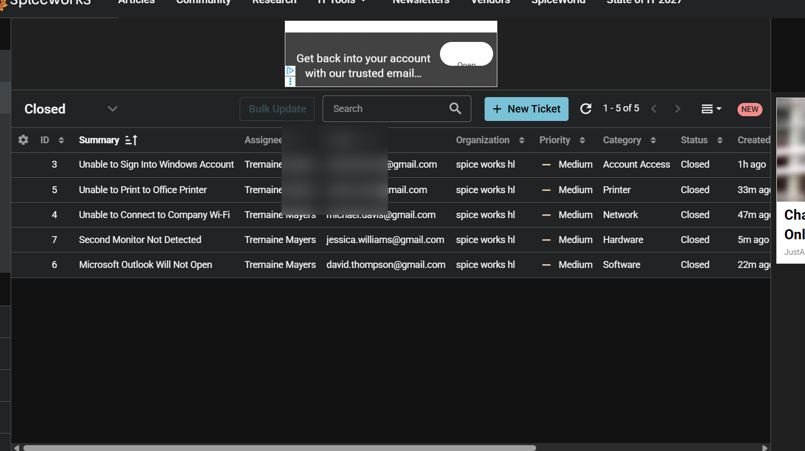
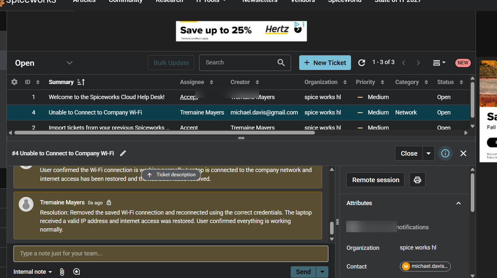
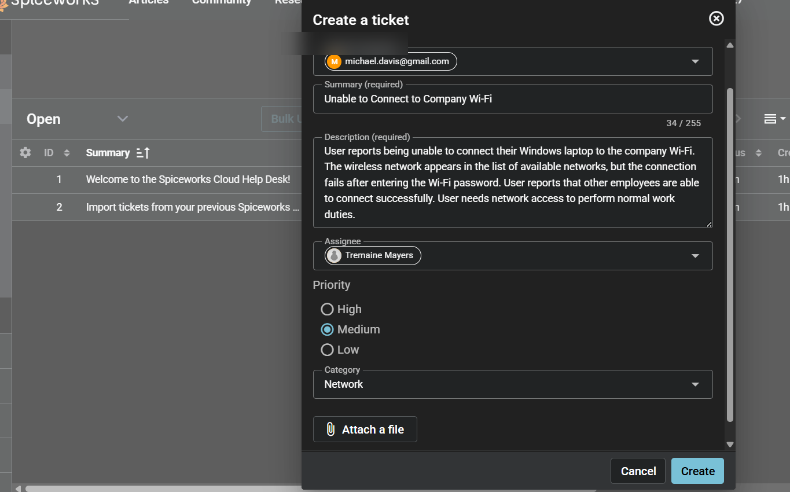
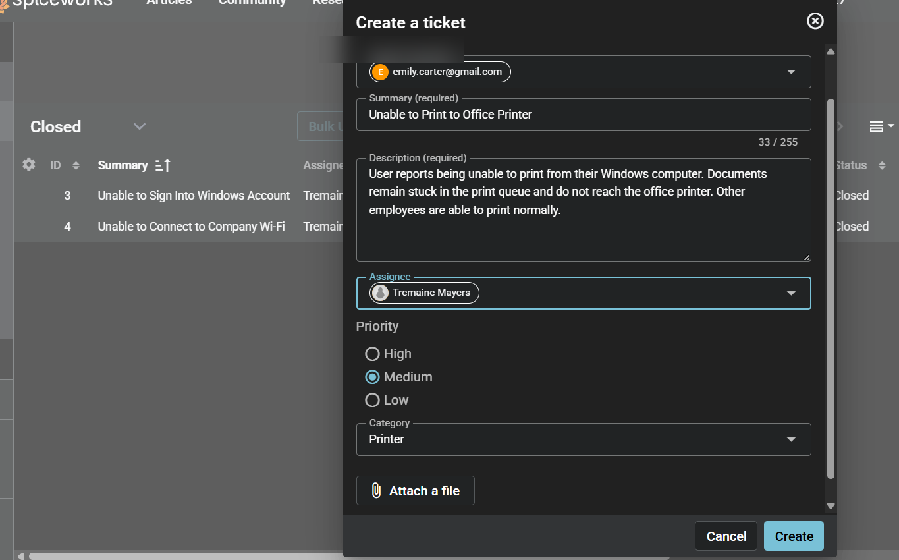
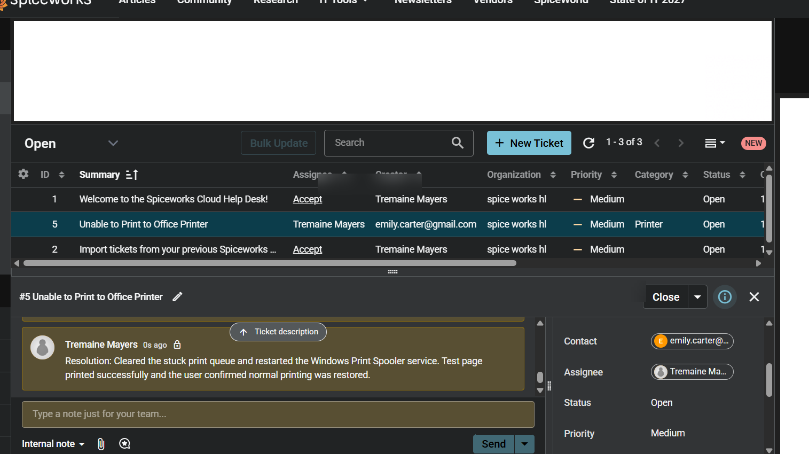
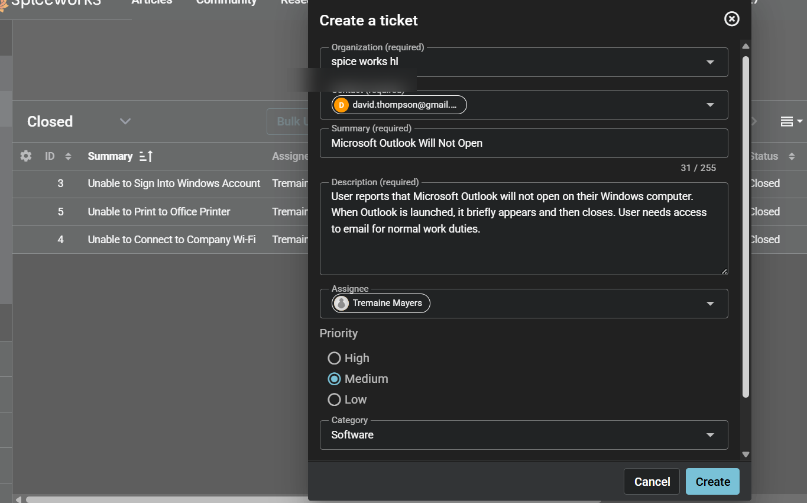
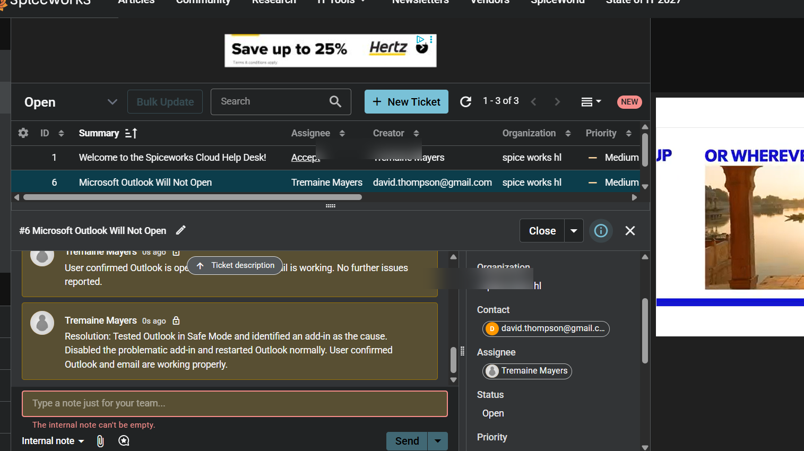
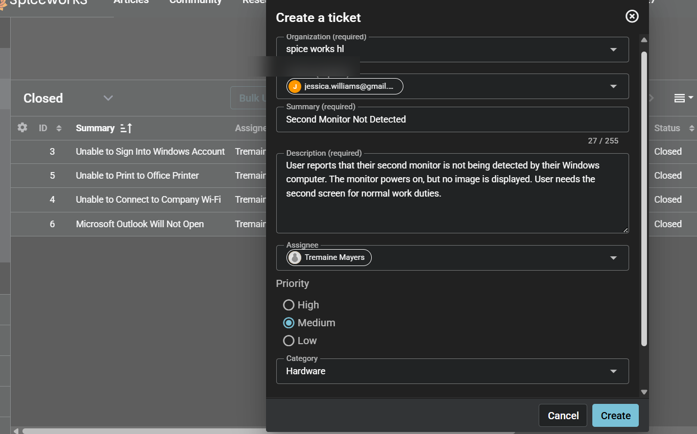
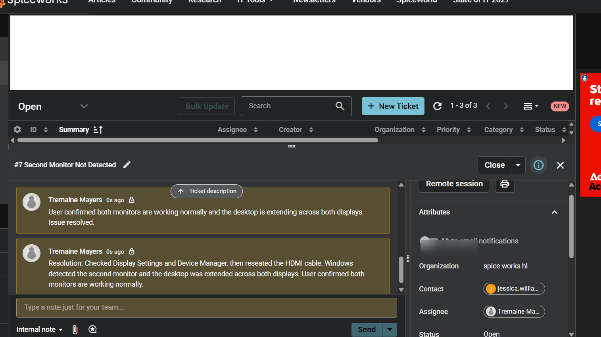

# Spiceworks IT Help Desk Home Lab

## Project Overview

This project is a simulated IT Help Desk environment created using Spiceworks Cloud Help Desk. The goal of the lab was to practice a realistic Tier 1 support workflow, including receiving support requests, categorizing and prioritizing incidents, troubleshooting technical issues, communicating with users, documenting technical work, verifying resolutions, and closing tickets.

Five simulated support tickets were completed across common Help Desk support areas.

## Tools & Technologies

- Spiceworks Cloud Help Desk
- Windows 10/11
- Microsoft Outlook
- Windows Device Manager
- Windows Display Settings
- Windows Print Spooler
- Basic network troubleshooting

## Skills Demonstrated

- IT ticket creation and management
- Incident categorization and prioritization
- Technical troubleshooting
- End-user communication
- Internal technician documentation
- Account access troubleshooting
- Network connectivity troubleshooting
- Printer troubleshooting
- Microsoft Outlook troubleshooting
- Hardware and peripheral troubleshooting
- Resolution verification and ticket closure

## Support Tickets

### Ticket #3 — Unable to Sign Into Windows Account
**Category:** Account Access  
**Priority:** Medium

**Issue:**  
User reported being unable to sign into a Windows workstation after multiple unsuccessful password attempts resulted in an account lockout.

**Troubleshooting & Resolution:**  
Reviewed the reported account issue and simulated the identity verification, account unlock, and password reset process. The user then successfully tested the new credentials and confirmed access was restored.

---

### Ticket #4 — Unable to Connect to Company Wi-Fi
**Category:** Network  
**Priority:** Medium

**Issue:**  
User could see the company wireless network but was unable to connect while other employees remained connected normally.

**Troubleshooting & Resolution:**  
Narrowed the issue to the user's laptop rather than a network-wide outage. The saved Wi-Fi connection was removed and the laptop was reconnected using the correct credentials. A valid IP address was obtained and internet connectivity was restored.

---

### Ticket #5 — Unable to Print to Office Printer
**Category:** Printer  
**Priority:** Medium

**Issue:**  
Documents remained stuck in the Windows print queue and were not reaching the office printer.

**Troubleshooting & Resolution:**  
Identified the stuck print queue, cleared the pending jobs, and restarted the Windows Print Spooler service. A test page printed successfully and normal printing was confirmed.

---

### Ticket #6 — Microsoft Outlook Will Not Open
**Category:** Software  
**Priority:** Medium

**Issue:**  
Microsoft Outlook briefly appeared and then closed when the user attempted to launch the application.

**Troubleshooting & Resolution:**  
Used a simulated Safe Mode troubleshooting workflow to isolate the issue to an Outlook add-in. The problematic add-in was disabled, Outlook was restarted normally, and the user confirmed email functionality was restored.

---

### Ticket #7 — Second Monitor Not Detected
**Category:** Hardware  
**Priority:** Medium

**Issue:**  
A second monitor had power but was not being detected by the user's Windows computer.

**Troubleshooting & Resolution:**  
Checked Windows Display Settings and Device Manager as part of the simulated troubleshooting process. The HDMI connection was reseated, Windows detected the second display, and the desktop was configured to extend across both monitors.

---

## Ticket Workflow

Each incident followed a structured Help Desk process:

1. Review the user's reported issue
2. Assign the ticket to a technician
3. Set the appropriate priority and category
4. Acknowledge the user's request
5. Document troubleshooting through internal notes
6. Communicate the proposed resolution to the user
7. Verify functionality with the user
8. Document the final resolution
9. Close the ticket

## Lab Results

Successfully completed and closed five simulated Help Desk incidents covering account access, networking, printing, software, and hardware support.

This lab provided hands-on practice with the ticket lifecycle and reinforced the importance of clear documentation, logical troubleshooting, user communication, and resolution verification in an IT support environment.

## Screenshots
### Completed Ticket Overview

The completed ticket queue demonstrates five resolved Tier 1 incidents across account access, networking, printer, software, and hardware support.

---

### Ticket #3 — Account Access

**Issue:** Windows account lockout after multiple unsuccessful sign-in attempts.

**Resolution Evidence:**

---

### Ticket #4 — Network Connectivity

**Issue:** User was unable to connect a Windows laptop to the company Wi-Fi while other users remained connected.

**Ticket Intake:**

**Resolution Evidence:**

---

### Ticket #5 — Printer Support

**Issue:** User was unable to print to the office printer due to a stuck print queue.

**Ticket Intake:**

**Resolution Evidence:**

---

### Ticket #6 — Software Support

**Issue:** Microsoft Outlook would briefly launch and then close on the user's Windows computer.

**Ticket Intake:**

**Resolution Evidence:**

---

### Ticket #7 — Hardware Support

**Issue:** A second monitor powered on but was not detected by the user's Windows computer.

**Ticket Intake:**

**Resolution Evidence:**

Screenshots documenting the ticket workflow and resolutions will be included in the `screenshots` folder.
